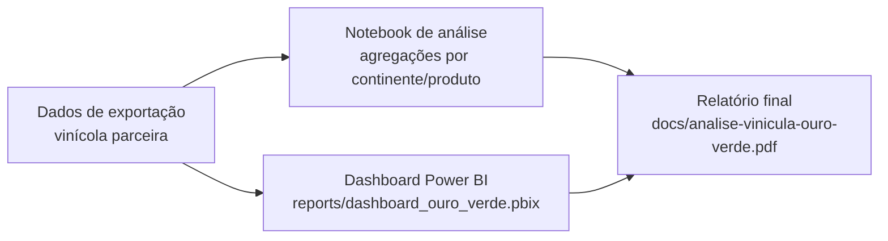

# 🍷 Desempenho Internacional da Vinícola Ouro Verde — Exportações de Vinhos Brasileiros


🔗 **[Dashboard ao vivo (Power BI)](https://app.powerbi.com/view?r=eyJrIjoiZTdlZjhhZWQtYzY1ZS00NGJiLWI0NjAtMWNiYzI5YWM5MDMyIiwidCI6ImFkYWMzNzYyLWYzMWQtNDliNS1iYWI1LWY3NjcxNzZmZjQyNSJ9)**

## 🎯 Problema de negócio

Simulação de consultoria em Data Analytics para a **Vinícola Ouro Verde** (Rio Grande do Sul), que exporta vinhos, espumantes, sucos de uva e uvas frescas para o mundo todo. A área de dados, recém-criada na empresa, foi acionada para construir os relatórios iniciais de uma reunião com investidores e acionistas, explicando:

- Quantidade e valor exportados por produto, país e continente.
- Fatores externos que influenciam a exportação (câmbio, crises econômicas, clima, mudanças de hábito de consumo).

> Projeto em grupo — Centro Universitário FIAP, 2024.

## 🏗️ Arquitetura / Fluxo de dados



## ⚙️ Fases de execução

### 1. Ingestão
Dados de exportação (país de origem, país de destino, litros exportados, valor em US$) fornecidos por uma vinícola parceira, cobrindo o período de **2007 a 2022**.

### 2. Transformação e análise
Agregações por produto (uvas frescas, vinho de mesa, espumantes, suco de uva), por país de destino e por continente. Parte das análises (ex: distribuição por continente) foi feita em notebook Python pela equipe de tecnologia — esse notebook ainda não está versionado neste repositório (ver Próximos passos).

### 3. Visualização
**Dashboard Power BI** interativo com mapa de distribuição por país, rankings de importadores e séries temporais por produto — usado como base para o relatório final entregue aos investidores.

### 4. Relatório
`docs/analise-vinicula-ouro-verde.pdf` consolida a análise completa: visão geral, exportação por continente, por produto (vinho de mesa, espumantes, suco de uva) e conclusão com recomendações.

## 🛠️ Stack técnica

| Camada | Tecnologia | Por quê |
|---|---|---|
| BI / Dashboard | **Power BI** | Storytelling interativo para apresentação a investidores |
| Análise complementar | **Python** (pandas/matplotlib, via notebook da equipe) | Gráficos de distribuição por continente citados no relatório |
| Documentação | PDF | Relatório final consolidado |

## 📈 Resultados / Insights

- **US$ 1,9 bilhão** exportados no total entre 2007-2022, sendo **uvas frescas ~85%** do valor exportado (matéria-prima usada por outros países para produção própria de vinho).
- **Vinho de mesa** foi o 2º produto mais exportado (9,23% do volume, 59% do volume entre produtos derivados), com pico de US$22,7 milhões em 2013.
- **Top importadores por valor:** Países Baixos, Reino Unido e Estados Unidos (uvas frescas); Paraguai, Rússia e EUA (vinho de mesa); EUA lidera espumantes com folga.
- **Ásia, América e Europa** concentram a maior parte das exportações, com destaque para Japão (maior comprador de suco de uva) e China/Coreia do Sul (mercado de vinho em ascensão via classe média).
- **2021 foi ano recorde**: 935 mil litros de espumante exportados e 303 medalhas internacionais para espumantes brasileiros.
- Fatores externos identificados como determinantes: câmbio (desvalorização do real aumenta competitividade), clima (safras de qualidade vs. geadas/secas), crises econômicas (2008, 2014-2016) e mudança de hábito de consumo durante a pandemia (aumento do consumo doméstico de bebidas alcoólicas).

## 🔭 Próximos passos

- [ ] Recuperar e versionar o notebook Python usado para as análises por continente (citado no relatório como "Notebook de análise desenvolvido pela equipe de tecnologia", ainda não commitado)
- [ ] Adicionar a base de dados de exportação (ou instruções de acesso) usada como fonte
- [ ] Automatizar a atualização do dashboard a partir de fonte de dados live em vez de extração pontual

## 👥 Autoria

[Michael Jourdain Gbedjinou](https://github.com/MichaelJourdain93) — Centro Universitário FIAP.

## 📁 Estrutura do projeto

```
VINICULA_TECH_CHALLENGE-/
├── README.md
├── docs/
│   └── analise-vinicula-ouro-verde.pdf
└── reports/
    └── dashboard_ouro_verde.pbix
```
